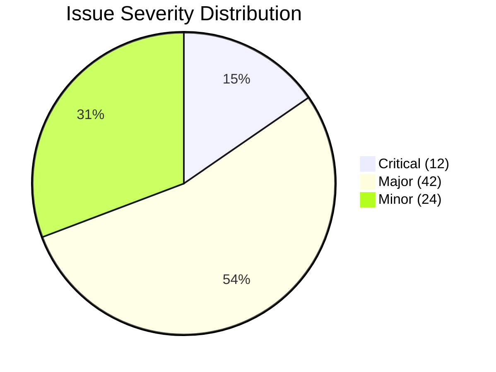

# LearnOnline — Comprehensive UX Audit Report

> [!NOTE]
> **Audit Date:** May 27, 2026
> **Scope:** Full frontend codebase review — 70+ files across all feature areas
> **Framework:** React 19 + Vite + Tailwind CSS 4 + DaisyUI 5

---

## Executive Summary

The LearnOnline application has a functional foundation but suffers from **significant UX standardization issues** that undermine user trust, accessibility, and maintainability. The audit identified **12 critical issues**, **40+ major issues**, and **20+ minor issues** spanning consistency, accessibility, interaction design, and code architecture.

The three highest-impact themes are:

1. **No standardized component library** — buttons, inputs, modals, and cards are all implemented inconsistently across the app
2. **Near-zero accessibility** — missing labels, keyboard traps, non-semantic elements, no focus management
3. **Monolithic components** — several files exceed 500+ lines, with [teacherCourses.jsx](file:///Users/rikuspretorius/Documents/learn-online/Frontend/src/pages/courses/teacherCourses.jsx) reaching **125KB (~3,500 lines)**



---

## 🔴 Critical Issues (Fix Immediately)

These issues severely impact usability, accessibility, or data integrity.

### 1. Monolithic Component Files

| File | Size | Est. Lines | Features Packed In |
|------|------|------------|-------------------|
| [teacherCourses.jsx](file:///Users/rikuspretorius/Documents/learn-online/Frontend/src/pages/courses/teacherCourses.jsx) | **125 KB** | ~3,500 | Course CRUD, module management, assignment CRUD, grading, student management, announcements, notes |
| [adminDashboard.jsx](file:///Users/rikuspretorius/Documents/learn-online/Frontend/src/pages/dashboards/adminDashboard.jsx) | 27 KB | ~750 | User management, course management, announcements, system stats |
| [weeklyHorizontalTimeline.jsx](file:///Users/rikuspretorius/Documents/learn-online/Frontend/src/components/weeklyHorizontalTimeline.jsx) | 38 KB | ~1,000 | Full weekly timeline with inline calculations, rendering, state |
| [studentAnalytics.jsx](file:///Users/rikuspretorius/Documents/learn-online/Frontend/src/pages/analytics/studentAnalytics.jsx) | 26 KB | ~740 | Multiple chart types, data fetching, complex rendering |
| [teacherAnalytics.jsx](file:///Users/rikuspretorius/Documents/learn-online/Frontend/src/pages/analytics/teacherAnalytics.jsx) | 29 KB | ~800 | Class performance, submission rates, comparison charts |

> [!CAUTION]
> `teacherCourses.jsx` at **125KB** is one of the largest single React component files possible. It handles 15+ features in one file, making it untestable, unmaintainable, and a guaranteed source of bugs. This MUST be decomposed.

**Impact:** Developer velocity drops, bugs cascade across features, impossible to unit test, state becomes unpredictable.

**Fix:** Decompose each file into feature-specific components with dedicated custom hooks for data management.

---

### 2. Browser `alert()` / `confirm()` for Critical Actions

Found in: [login.jsx](file:///Users/rikuspretorius/Documents/learn-online/Frontend/src/pages/login.jsx), [signup.jsx](file:///Users/rikuspretorius/Documents/learn-online/Frontend/src/pages/signup.jsx), [adminDashboard.jsx](file:///Users/rikuspretorius/Documents/learn-online/Frontend/src/pages/dashboards/adminDashboard.jsx), [settings.jsx](file:///Users/rikuspretorius/Documents/learn-online/Frontend/src/pages/settings.jsx)

```diff
- alert("Login failed!");
- if (window.confirm("Delete this user?")) { ... }
+ // Use inline error messages for validation
+ // Use custom confirmation modals for destructive actions
```

**Impact:** Looks unprofessional, blocks the main thread, can't be styled, no accessibility support, some mobile browsers handle them poorly.

**Fix:** Create a standardized `<Toast>` component for notifications and `<ConfirmDialog>` for destructive actions.

---

### 3. No 404 / Error Boundary Pages

Found in: [App.jsx](file:///Users/rikuspretorius/Documents/learn-online/Frontend/src/App.jsx)

- No `<Route path="*">` catch-all — invalid URLs show a blank page
- No `<ErrorBoundary>` — if any component crashes, the entire app goes white
- No global error handling for failed API calls

**Impact:** Users encountering errors see nothing — no feedback, no recovery path, no way to navigate back.

**Fix:**
- Add a `<NotFound />` page for unknown routes
- Add `<ErrorBoundary>` wrapping the main content area
- Add a global API error interceptor

---

### 4. Unimplemented Pages Showing Blank Content

| Page | File | Current State |
|------|------|---------------|
| Admin Calendar | [adminCalendar.jsx](file:///Users/rikuspretorius/Documents/learn-online/Frontend/src/pages/calendars/adminCalendar.jsx) | Shows only "Admin Calendar" text |
| Admin Courses | [adminCourses.jsx](file:///Users/rikuspretorius/Documents/learn-online/Frontend/src/pages/courses/adminCourses.jsx) | Minimal placeholder |

**Impact:** Users navigate to these pages expecting functionality and find nothing.

**Fix:** Either implement the features or show a polished "Coming Soon" state with navigation back.

---

### 5. Signup Route Missing — Registration Unreachable

Found in: [App.jsx](file:///Users/rikuspretorius/Documents/learn-online/Frontend/src/App.jsx), [authService.jsx](file:///Users/rikuspretorius/Documents/learn-online/Frontend/src/services/authService.jsx)

- **No `/signup` route defined in App.jsx** — the signup page exists but is completely unreachable via routing
- **No path to signup from onboarding or login pages** — new users have zero way to create an account
- `registerUser` and `saveAuthSession` are imported in [signup.jsx](file:///Users/rikuspretorius/Documents/learn-online/Frontend/src/pages/signup.jsx) but **don't exist in authService.jsx** — signup crashes at runtime
- The onboarding page only links to login pages, never to signup

**Impact:** New users literally cannot register. This is the most fundamental flow breakage possible.

**Fix:** Add `/signup` route, implement `registerUser` in authService, add "Create account" links on login and onboarding pages.

---

### 6. Focus Styles Destroyed in CSS

Found in: [index.css](file:///Users/rikuspretorius/Documents/learn-online/Frontend/src/index.css) (lines 184–195)

```css
/* Lines 184-189: Sets a visible focus outline */
*:focus { outline: 3px solid #9BE9EA; }

/* Lines 191-195: IMMEDIATELY OVERRIDES IT WITH NOTHING */
*:focus { outline: none !important; }
```

The CSS first defines a focus style, then **destroys it with `!important`**. Additionally, DaisyUI menu focus styles are suppressed with `outline: none !important` (lines 208-216). **Keyboard users have zero focus indicators anywhere in the entire app.**

**Impact:** Complete keyboard accessibility failure. WCAG 2.4.7 violation.

**Fix:** Remove the second rule block. Use `:focus-visible` instead of `:focus` to avoid mouse-click outlines while preserving keyboard focus.

---

### 7. Duplicate Files in Codebase

| Duplicate | Original |
|-----------|----------|
| `eventModal 2.jsx` | `eventModal.jsx` |
| `courses 2.jsx` | `courses.jsx` |
| `calendar 2.jsx` | `calendar.jsx` |
| `eventService 2.jsx` | `eventService.jsx` |

**Impact:** Developers may edit the wrong file, leading to bugs that appear random. Indicates no code review process.

**Fix:** Delete all duplicate files immediately.

---

### 8. Calendar Code Duplication (~95%)

[studentCalendar.jsx](file:///Users/rikuspretorius/Documents/learn-online/Frontend/src/pages/calendars/studentCalendar.jsx) and [teacherCalendar.jsx](file:///Users/rikuspretorius/Documents/learn-online/Frontend/src/pages/calendars/teacherCalendar.jsx) share ~95% identical code.

**Fix:** Extract a shared `<BaseCalendar>` component with role-based configuration props.

---

## 🟠 Major Issues (Fix Soon)

### A. Accessibility

> [!WARNING]
> The application has **near-zero accessibility compliance**. It would fail a WCAG 2.1 AA audit comprehensively.

| Issue | Files Affected | Fix |
|-------|---------------|-----|
| No `<label>` elements on form inputs — placeholder-only | [authInput.jsx](file:///Users/rikuspretorius/Documents/learn-online/Frontend/src/components/UI/authInput.jsx), all forms | Add proper `<label>` with `htmlFor` |
| Interactive elements use `<div onClick>` instead of `<button>` | [sideMenu.jsx](file:///Users/rikuspretorius/Documents/learn-online/Frontend/src/components/sideMenu.jsx), [moduleAccordion.jsx](file:///Users/rikuspretorius/Documents/learn-online/Frontend/src/components/moduleAccordion.jsx), [toDoItem.jsx](file:///Users/rikuspretorius/Documents/learn-online/Frontend/src/components/UI/toDoItem.jsx), [timelineEventExpanded.jsx](file:///Users/rikuspretorius/Documents/learn-online/Frontend/src/components/UI/timelineEventExpanded.jsx) | Replace with semantic `<button>` elements |
| No focus management in modals | [eventModal.jsx](file:///Users/rikuspretorius/Documents/learn-online/Frontend/src/components/eventModal.jsx), [courseManagerModal.jsx](file:///Users/rikuspretorius/Documents/learn-online/Frontend/src/components/courseManagerModal.jsx) | Add focus trapping and `Escape` key dismiss |
| Charts/graphs inaccessible to screen readers | [studentAnalytics.jsx](file:///Users/rikuspretorius/Documents/learn-online/Frontend/src/pages/analytics/studentAnalytics.jsx), [teacherAnalytics.jsx](file:///Users/rikuspretorius/Documents/learn-online/Frontend/src/pages/analytics/teacherAnalytics.jsx), [attendanceChart.jsx](file:///Users/rikuspretorius/Documents/learn-online/Frontend/src/components/UI/attendanceChart.jsx) | Add `aria-label` with data summaries |
| No skip-to-content link | [App.jsx](file:///Users/rikuspretorius/Documents/learn-online/Frontend/src/App.jsx) | Add skip nav link at top of page |
| No `aria-label` on navigation elements | [menu.jsx](file:///Users/rikuspretorius/Documents/learn-online/Frontend/src/components/menu.jsx), [sideMenu.jsx](file:///Users/rikuspretorius/Documents/learn-online/Frontend/src/components/sideMenu.jsx) | Add `role="navigation"` and `aria-label` |
| Side nav has no text labels — icons only | [sideMenu.jsx](file:///Users/rikuspretorius/Documents/learn-online/Frontend/src/components/sideMenu.jsx) | Add tooltips and `aria-label` |
| No focus-visible styles anywhere | Global | Add `:focus-visible` ring styles in CSS |
| `prefers-reduced-motion` not respected | [clickSpark.jsx](file:///Users/rikuspretorius/Documents/learn-online/Frontend/src/components/UI/clickSpark.jsx), [Orb.jsx](file:///Users/rikuspretorius/Documents/learn-online/Frontend/src/components/UI/Orb.jsx) | Check and respect `prefers-reduced-motion` |
| `progressRing.jsx` has no screen reader text | [progressRing.jsx](file:///Users/rikuspretorius/Documents/learn-online/Frontend/src/components/UI/progressRing.jsx) | Add `aria-label` with percentage value |

---

### B. Loading, Error & Empty States

> [!IMPORTANT]
> Almost **no component in the entire app** properly handles loading, error, or empty states. This creates a poor user experience where the interface feels "broken" or "frozen" during data fetches.

| Component | Missing States |
|-----------|---------------|
| [studentDashboard.jsx](file:///Users/rikuspretorius/Documents/learn-online/Frontend/src/pages/dashboards/studentDashboard.jsx) | Loading, empty |
| [teacherDashboard.jsx](file:///Users/rikuspretorius/Documents/learn-online/Frontend/src/pages/dashboards/teacherDashboard.jsx) | Loading, empty |
| [adminDashboard.jsx](file:///Users/rikuspretorius/Documents/learn-online/Frontend/src/pages/dashboards/adminDashboard.jsx) | Loading, error |
| [studentCourses.jsx](file:///Users/rikuspretorius/Documents/learn-online/Frontend/src/pages/courses/studentCourses.jsx) | Loading, empty |
| [coursesMenu.jsx](file:///Users/rikuspretorius/Documents/learn-online/Frontend/src/components/coursesMenu.jsx) | Loading, empty |
| [studentCalendar.jsx](file:///Users/rikuspretorius/Documents/learn-online/Frontend/src/pages/calendars/studentCalendar.jsx) / [teacherCalendar.jsx](file:///Users/rikuspretorius/Documents/learn-online/Frontend/src/pages/calendars/teacherCalendar.jsx) | Loading, error |
| [todayTimeline.jsx](file:///Users/rikuspretorius/Documents/learn-online/Frontend/src/components/todayTimeline.jsx) | Empty state |
| [CoursesContext.jsx](file:///Users/rikuspretorius/Documents/learn-online/Frontend/src/contexts/CoursesContext.jsx) | Loading, error |
| [AuthContext.jsx](file:///Users/rikuspretorius/Documents/learn-online/Frontend/src/contexts/AuthContext.jsx) | Loading (auth check) |
| [assistantInput.jsx](file:///Users/rikuspretorius/Documents/learn-online/Frontend/src/components/assistantInput.jsx) | AI response loading indicator |

**Recommended Standard Pattern:**
```jsx
// Every data-driven component should follow this pattern:
if (isLoading) return <SkeletonLoader />;
if (error) return <ErrorState message={error} onRetry={refetch} />;
if (!data?.length) return <EmptyState title="No items" action={<Button>Create</Button>} />;
return <ActualContent data={data} />;
```

---

### C. Form & Input Standardization

| Issue | Where | Fix |
|-------|-------|-----|
| No client-side validation before submission | [login.jsx](file:///Users/rikuspretorius/Documents/learn-online/Frontend/src/pages/login.jsx), [signup.jsx](file:///Users/rikuspretorius/Documents/learn-online/Frontend/src/pages/signup.jsx) | Add validation with error display |
| No password visibility toggle | [login.jsx](file:///Users/rikuspretorius/Documents/learn-online/Frontend/src/pages/login.jsx), [signup.jsx](file:///Users/rikuspretorius/Documents/learn-online/Frontend/src/pages/signup.jsx) | Add show/hide password button |
| No `autocomplete` attributes | [authInput.jsx](file:///Users/rikuspretorius/Documents/learn-online/Frontend/src/components/UI/authInput.jsx) | Add proper `autocomplete` values |
| No password strength indicator | [signup.jsx](file:///Users/rikuspretorius/Documents/learn-online/Frontend/src/pages/signup.jsx) | Add strength meter and requirements list |
| No submit button disabled state | Login, signup, all modals | Disable during submission with spinner |
| No error state styling on inputs | [authInput.jsx](file:///Users/rikuspretorius/Documents/learn-online/Frontend/src/components/UI/authInput.jsx) | Add red border + error text on invalid |
| "Forgot password" link is dead | [login.jsx](file:///Users/rikuspretorius/Documents/learn-online/Frontend/src/pages/login.jsx) | Implement or remove |
| File upload has no validation or progress | [assignmentDetail.jsx](file:///Users/rikuspretorius/Documents/learn-online/Frontend/src/pages/courses/assignmentDetail.jsx) | Add file type/size validation + progress bar |
| Modal forms have no unsaved-changes warning | [courseManagerModal.jsx](file:///Users/rikuspretorius/Documents/learn-online/Frontend/src/components/courseManagerModal.jsx), [eventModal.jsx](file:///Users/rikuspretorius/Documents/learn-online/Frontend/src/components/eventModal.jsx) | Add discard confirmation |

---

### D. Navigation & Information Architecture

| Issue | Details | Fix |
|-------|---------|-----|
| Role names exposed in URLs | `/studentDashboard`, `/teacherCourses`, `/adminCalendar` | Use unified routes: `/dashboard`, `/courses`, `/calendar` with role-based rendering |
| Decorative search bar | [menu.jsx](file:///Users/rikuspretorius/Documents/learn-online/Frontend/src/components/menu.jsx) has a search input with no functionality | Implement search or remove |
| No active state on side nav | [sideMenu.jsx](file:///Users/rikuspretorius/Documents/learn-online/Frontend/src/components/sideMenu.jsx) doesn't highlight current page | Add active indicator |
| Tab state not in URL | [courseSecondaryNav.jsx](file:///Users/rikuspretorius/Documents/learn-online/Frontend/src/components/courseSecondaryNav.jsx), [profile.jsx](file:///Users/rikuspretorius/Documents/learn-online/Frontend/src/pages/profile/profile.jsx) — refreshing loses tab | Use URL query params for tabs |
| No breadcrumbs | Anywhere in the app | Add breadcrumbs on nested pages |
| Silent role-based redirects | [ProtectedRoute.jsx](file:///Users/rikuspretorius/Documents/learn-online/Frontend/src/components/ProtectedRoute.jsx) redirects without explanation | Show "unauthorized" message |
| No route transitions | [App.jsx](file:///Users/rikuspretorius/Documents/learn-online/Frontend/src/App.jsx) | Add page transition animations (Framer Motion is installed) |
| Profile avatar has no fallback | [menu.jsx](file:///Users/rikuspretorius/Documents/learn-online/Frontend/src/components/menu.jsx) | Add `onError` fallback to initials |

---

### E. Visual & Design Consistency

| Issue | Details | Fix |
|-------|---------|-----|
| Mixed styling approaches | Inline styles + Tailwind + DaisyUI + custom CSS used interchangeably | Standardize on Tailwind + DaisyUI |
| `navItem.jsx` uses inline styles, `sideNavItem.jsx` uses Tailwind | [navItem.jsx](file:///Users/rikuspretorius/Documents/learn-online/Frontend/src/components/UI/navItem.jsx) vs [sideNavItem.jsx](file:///Users/rikuspretorius/Documents/learn-online/Frontend/src/components/UI/sideNavItem.jsx) | Pick one approach |
| Hardcoded colors throughout | Various files use hex/rgb values instead of theme variables | Use DaisyUI theme tokens or CSS variables |
| Inconsistent card styles | Settings sections, dashboard cards, course cards all look different | Create a shared `<Card>` component |
| Inconsistent button styles | [onboardingButton.jsx](file:///Users/rikuspretorius/Documents/learn-online/Frontend/src/components/UI/onboardingButton.jsx) vs auth buttons vs admin buttons | Create `<Button>` with `variant` prop |
| Dashboard layouts differ wildly by role | Student vs teacher vs admin dashboards look like different apps | Harmonize the base layout grid |
| `index.html` has default "Vite + React" title | [index.html](file:///Users/rikuspretorius/Documents/learn-online/Frontend/index.html) | Change to "LearnOnline" |
| No light theme available | [index.css](file:///Users/rikuspretorius/Documents/learn-online/Frontend/src/index.css) only defines dark theme | Add light theme and working toggle |
| Font sizes use `px` instead of `rem` | [index.css](file:///Users/rikuspretorius/Documents/learn-online/Frontend/src/index.css) | Use `rem` for accessibility |

---

### F. Performance Concerns

| Issue | Details | Fix |
|-------|---------|-----|
| `ClickSpark` wraps entire app | [main.jsx](file:///Users/rikuspretorius/Documents/learn-online/Frontend/src/main.jsx) — particle effect on every click | Make opt-in or remove |
| `Orb.jsx` uses WebGL | [Orb.jsx](file:///Users/rikuspretorius/Documents/learn-online/Frontend/src/components/UI/Orb.jsx) — GPU-intensive on all pages | Add performance detection, limit to specific pages |
| Animated gradient on login | [login.jsx](file:///Users/rikuspretorius/Documents/learn-online/Frontend/src/pages/login.jsx) — CPU-intensive animation | Use `will-change`, reduce complexity |
| `weeklyHorizontalTimeline` recalculates on every render | [weeklyHorizontalTimeline.jsx](file:///Users/rikuspretorius/Documents/learn-online/Frontend/src/components/weeklyHorizontalTimeline.jsx) | Add `useMemo` for expensive calculations |
| Admin tables render all rows | [adminDashboard.jsx](file:///Users/rikuspretorius/Documents/learn-online/Frontend/src/pages/dashboards/adminDashboard.jsx) | Add pagination or virtual scrolling |
| `body { overflow: hidden }` | [index.css](file:///Users/rikuspretorius/Documents/learn-online/Frontend/src/index.css) | Apply overflow hidden only where needed |

---

## 🟡 Minor Issues

| # | Issue | File(s) | Fix |
|---|-------|---------|-----|
| 1 | No "Remember me" on login | [login.jsx](file:///Users/rikuspretorius/Documents/learn-online/Frontend/src/pages/login.jsx) | Add checkbox |
| 2 | No terms of service checkbox on signup | [signup.jsx](file:///Users/rikuspretorius/Documents/learn-online/Frontend/src/pages/signup.jsx) | Add required checkbox |
| 3 | Token stored without expiry check | [AuthContext.jsx](file:///Users/rikuspretorius/Documents/learn-online/Frontend/src/contexts/AuthContext.jsx) | Check token expiry on load |
| 4 | No token refresh logic | [authService.jsx](file:///Users/rikuspretorius/Documents/learn-online/Frontend/src/services/authService.jsx) | Implement refresh flow |
| 5 | Calendar doesn't persist preferred view | Calendar files | Save to localStorage |
| 6 | 24-hour time format with no preference | [todayTimeline.jsx](file:///Users/rikuspretorius/Documents/learn-online/Frontend/src/components/todayTimeline.jsx) | Allow 12/24 toggle |
| 7 | No undo for to-do completion | [toDoItem.jsx](file:///Users/rikuspretorius/Documents/learn-online/Frontend/src/components/UI/toDoItem.jsx) | Add undo toast |
| 8 | Announcements truncated with no "read more" | [announcementsItem.jsx](file:///Users/rikuspretorius/Documents/learn-online/Frontend/src/components/UI/announcementsItem.jsx) | Add expand option |
| 9 | Due dates use absolute format only | [assignmentItem.jsx](file:///Users/rikuspretorius/Documents/learn-online/Frontend/src/components/UI/assignmentItem.jsx) | Add relative time ("in 3 days") |
| 10 | No data export from analytics | Analytics pages | Add CSV/PDF download |
| 11 | Chat messages have no timestamps | [assistantInput.jsx](file:///Users/rikuspretorius/Documents/learn-online/Frontend/src/components/assistantInput.jsx) | Add timestamps |
| 12 | Chat history lost on refresh | [assistantInput.jsx](file:///Users/rikuspretorius/Documents/learn-online/Frontend/src/components/assistantInput.jsx) | Persist to localStorage |
| 13 | Scrollbar styles only work in WebKit | [index.css](file:///Users/rikuspretorius/Documents/learn-online/Frontend/src/index.css) | Add Firefox `scrollbar-width` |
| 14 | No `<React.StrictMode>` in development | [main.jsx](file:///Users/rikuspretorius/Documents/learn-online/Frontend/src/main.jsx) | Wrap in StrictMode |
| 15 | No settings search on long settings page | [settings.jsx](file:///Users/rikuspretorius/Documents/learn-online/Frontend/src/pages/settings.jsx) | Add search or sections nav |
| 16 | Course names may truncate without tooltip | [coursesMenu.jsx](file:///Users/rikuspretorius/Documents/learn-online/Frontend/src/components/coursesMenu.jsx) | Add ellipsis + tooltip |
| 17 | Overdue vs upcoming assignments look the same | [assignmentItem.jsx](file:///Users/rikuspretorius/Documents/learn-online/Frontend/src/components/UI/assignmentItem.jsx) | Add urgency colors |
| 18 | Icon sizes inconsistent in teacher shortcuts | [teacherShortcuts.jsx](file:///Users/rikuspretorius/Documents/learn-online/Frontend/src/components/teacherShortcuts.jsx) | Standardize |
| 19 | `progressRing` has no value-change animation | [progressRing.jsx](file:///Users/rikuspretorius/Documents/learn-online/Frontend/src/components/UI/progressRing.jsx) | Add CSS transition |
| 20 | Attendance charts lack color legends | [attendanceChart.jsx](file:///Users/rikuspretorius/Documents/learn-online/Frontend/src/components/UI/attendanceChart.jsx) | Add legend |
| 21 | No `meta viewport` tag | [index.html](file:///Users/rikuspretorius/Documents/learn-online/Frontend/index.html) | Add `<meta name="viewport">` |
| 22 | Profile save feedback unclear | [profile.jsx](file:///Users/rikuspretorius/Documents/learn-online/Frontend/src/pages/profile/profile.jsx) | Add toast on save |
| 23 | Profile sub-components each fetch independently | Profile components | Lift data fetch to parent |
| 24 | Notification settings exist but notifications aren't implemented | [settings.jsx](file:///Users/rikuspretorius/Documents/learn-online/Frontend/src/pages/settings.jsx) | Implement or remove |

---

## Prioritized Action Plan

### Phase 1 — Foundation (Week 1–2)
> Fixes that every other improvement depends on.

- [ ] **Delete duplicate files** (`eventModal 2.jsx`, `courses 2.jsx`, `calendar 2.jsx`, `eventService 2.jsx`)
- [ ] **Add `/signup` route** and implement `registerUser` in authService — users currently cannot register
- [ ] **Fix destroyed focus styles** in [index.css](file:///Users/rikuspretorius/Documents/learn-online/Frontend/src/index.css) — remove `outline: none !important` overrides
- [ ] **Add meta viewport tag** to [index.html](file:///Users/rikuspretorius/Documents/learn-online/Frontend/index.html)
- [ ] **Add 404 page** and `<ErrorBoundary>` to [App.jsx](file:///Users/rikuspretorius/Documents/learn-online/Frontend/src/App.jsx)
- [ ] **Fix responsive padding** — replace `pl-40 pr-40` in App.jsx with responsive values
- [ ] **Fix `overflow-hidden`** on teacher and admin dashboards — content is permanently hidden
- [ ] **Create a shared component library**: `<Button>`, `<Card>`, `<Input>`, `<Modal>`, `<Toast>`, `<ConfirmDialog>`, `<SkeletonLoader>`, `<EmptyState>`, `<ErrorState>`
- [ ] **Standardize routing** — unify role-based URLs to `/dashboard`, `/courses`, etc.
- [ ] **Add loading/error states** to [AuthContext.jsx](file:///Users/rikuspretorius/Documents/learn-online/Frontend/src/contexts/AuthContext.jsx) and [CoursesContext.jsx](file:///Users/rikuspretorius/Documents/learn-online/Frontend/src/contexts/CoursesContext.jsx)
- [ ] **Remove or implement inert buttons** — "Add Task", search bar, assistant buttons, etc.
- [ ] **Prevent role self-assignment** — users can set themselves as Admin in both signup and settings

### Phase 2 — Accessibility Sprint (Week 2–3)
> Bring the app to minimum WCAG 2.1 AA compliance.

- [ ] Replace all `<div onClick>` with `<button>` or `<a>` elements
- [ ] Add `<label>` elements to all form inputs
- [ ] Add `aria-label` to all navigation elements
- [ ] Add focus trapping to all modals
- [ ] Add `:focus-visible` styles globally
- [ ] Add skip-to-content link
- [ ] Respect `prefers-reduced-motion`
- [ ] Add `aria-label` to charts and progress indicators

### Phase 3 — Auth & Forms Polish (Week 3–4)
> Make first impressions professional.

- [ ] Replace all `alert()`/`confirm()` with inline feedback and custom modals
- [ ] Add client-side form validation with real-time feedback
- [ ] Add password visibility toggle and strength meter
- [ ] Add `autocomplete` attributes
- [ ] Add loading/disabled states to all submit buttons
- [ ] Implement or remove "Forgot password"
- [ ] Add unsaved-changes warnings to modal forms

### Phase 4 — Component Decomposition (Week 4–6)
> Break monoliths into maintainable pieces.

- [ ] Decompose [teacherCourses.jsx](file:///Users/rikuspretorius/Documents/learn-online/Frontend/src/pages/courses/teacherCourses.jsx) into 10–15 focused components
- [ ] Decompose [adminDashboard.jsx](file:///Users/rikuspretorius/Documents/learn-online/Frontend/src/pages/dashboards/adminDashboard.jsx) into feature-specific components
- [ ] Decompose [weeklyHorizontalTimeline.jsx](file:///Users/rikuspretorius/Documents/learn-online/Frontend/src/components/weeklyHorizontalTimeline.jsx) into composable timeline pieces
- [ ] Extract shared `<BaseCalendar>` from student/teacher calendars
- [ ] Split analytics into chart-specific components with data hooks

### Phase 5 — Loading States & Empty States (Week 5–6)
> Make the app feel responsive and alive.

- [ ] Add skeleton loaders to all data-driven pages
- [ ] Add empty states with CTAs to all list views
- [ ] Add error states with retry buttons to all API-driven components
- [ ] Add loading spinners to all async operations

### Phase 6 — Polish & Delight (Week 6–8)
> Standard UX enhancements.

- [ ] Add page transition animations (Framer Motion is already installed)
- [ ] Implement search functionality or remove the search bar
- [ ] Add breadcrumbs on nested pages
- [ ] Add active state to side navigation
- [ ] Add tooltips to icon-only buttons
- [ ] Add light theme and working theme toggle
- [ ] Implement "Coming Soon" pages for unbuilt features
- [ ] Add relative time formatting ("in 3 days", "2 hours ago")
- [ ] Add pagination to admin data tables
- [ ] Persist tab state in URL query parameters

---

## Architecture Recommendations

### Recommended Component Library Structure

```
src/
  components/
    ui/                    # ← Standardized, reusable primitives
      Button.jsx           # Variants: primary, secondary, ghost, danger
      Card.jsx             # Consistent card wrapper
      Input.jsx            # With label, error state, validation
      Modal.jsx            # Focus trap, Escape dismiss, portal
      Toast.jsx            # Success, error, warning, info
      ConfirmDialog.jsx    # For destructive actions
      SkeletonLoader.jsx   # Content placeholders
      EmptyState.jsx       # "No items" with CTA
      ErrorState.jsx       # Error with retry
      Avatar.jsx           # With fallback to initials
      Badge.jsx            # Status indicators
      Tabs.jsx             # URL-synced tab navigation
      Breadcrumbs.jsx      # Navigation breadcrumbs
    layout/                # ← Structural components
      AppShell.jsx         # Menu + SideMenu + Content area
      PageHeader.jsx       # Consistent page headers
    features/              # ← Feature-specific composites
      calendar/
      courses/
      dashboard/
      analytics/
      profile/
```

### Recommended State Management Pattern

```jsx
// Custom hook for data fetching with standard states
function useCourses() {
  const [data, setData] = useState(null);
  const [isLoading, setIsLoading] = useState(true);
  const [error, setError] = useState(null);

  // ... fetch logic with proper error handling

  return { data, isLoading, error, refetch };
}
```

---

## Summary Scorecard

| Category | Score | Notes |
|----------|-------|-------|
| **Consistency** | 3/10 | Mixed styling, no component library, role views look like different apps |
| **Accessibility** | 1/10 | Near-zero compliance — no labels, no keyboard nav, no screen reader support |
| **Loading & Error UX** | 2/10 | Almost no loading states, no error boundaries, no empty states |
| **Form Design** | 3/10 | Basic inputs work but no validation, no feedback, browser alerts |
| **Navigation** | 4/10 | Functional but role-leaked URLs, no breadcrumbs, dead search bar |
| **Visual Design** | 5/10 | Dark theme looks decent but inconsistent cards/buttons/spacing |
| **Responsiveness** | 3/10 | Timeline unusable on mobile, side nav may overlap, no viewport meta |
| **Performance** | 4/10 | WebGL effects on all pages, no pagination, no memoization |
| **Code Architecture** | 2/10 | 125KB monolith, duplicate files, no shared components |
| **Overall UX** | **3/10** | Functional prototype that needs significant standardization work |

---

## Additional Critical Finding: Security Concerns

| Issue | Details |
|-------|--------|
| **Self-assign Admin role** | Both [signup.jsx](file:///Users/rikuspretorius/Documents/learn-online/Frontend/src/pages/signup.jsx) and [settings.jsx](file:///Users/rikuspretorius/Documents/learn-online/Frontend/src/pages/settings.jsx) allow users to select/change their role to Admin with no server-side guard |
| **No role-based route protection** | [ProtectedRoute](file:///Users/rikuspretorius/Documents/learn-online/Frontend/src/components/ProtectedRoute.jsx) supports `allowedRoles` but it's **never used in App.jsx** — any authenticated user can access any route |
| **Token not validated** | [AuthContext.jsx](file:///Users/rikuspretorius/Documents/learn-online/Frontend/src/contexts/AuthContext.jsx) loads raw JSON from localStorage and trusts it without expiry check or server validation |
| **PII in localStorage** | Full user object stored as plain JSON in localStorage instead of just a token |
